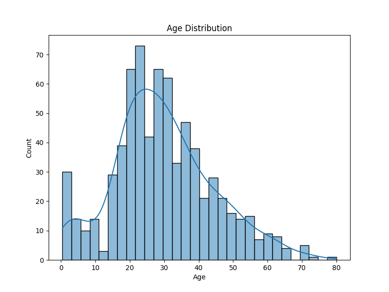
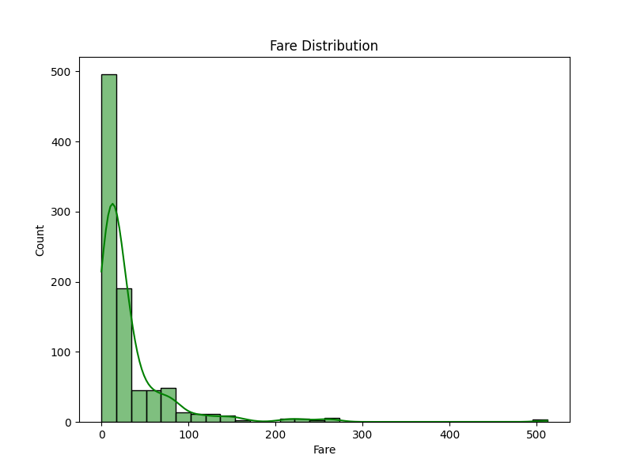
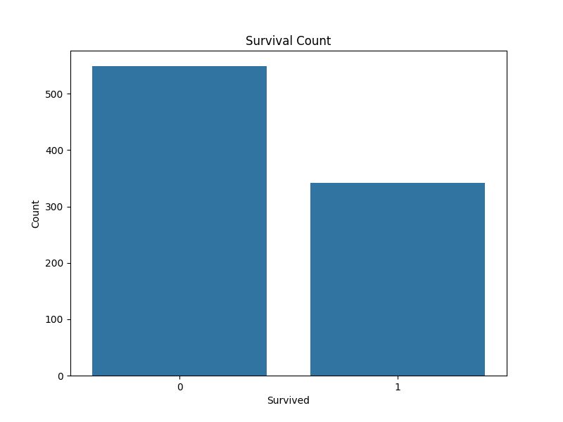
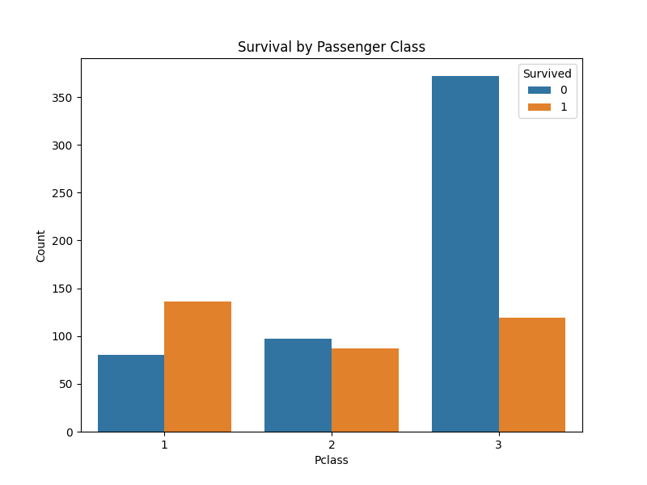
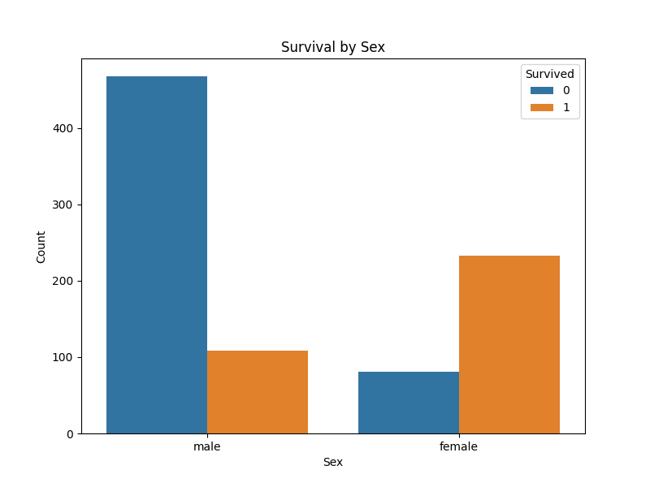
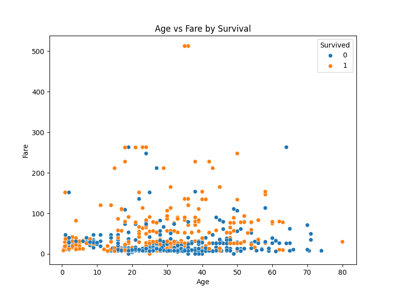
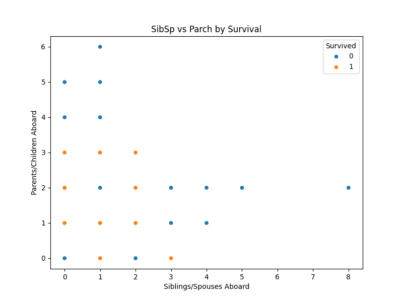
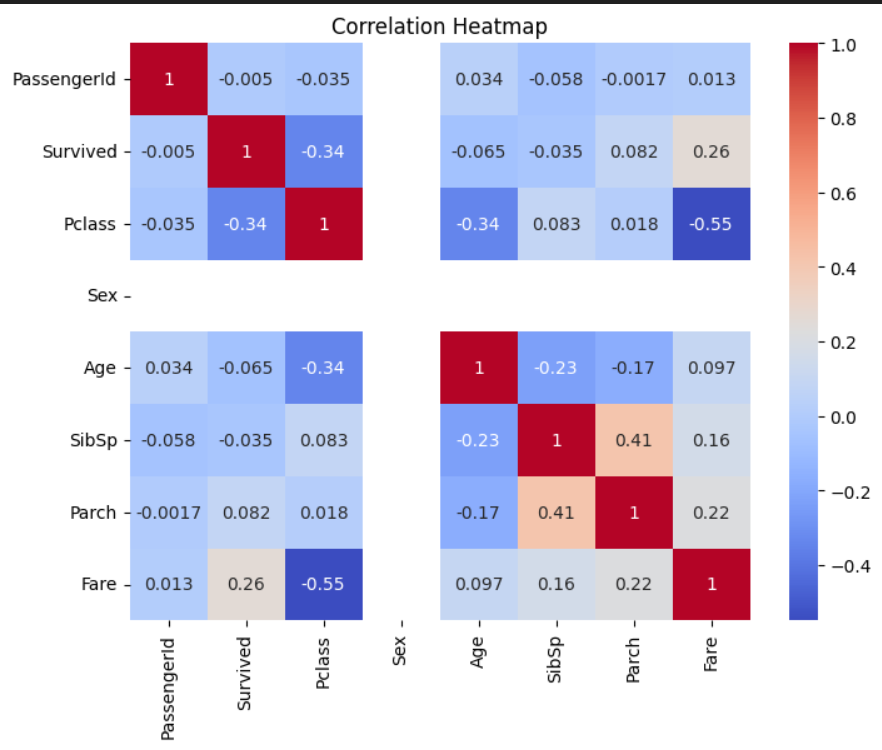

# 📊 Data Analysis Project  
# Titanic Dataset

## 📌 Project Overview  
This project analyzes the **Titanic passenger dataset** to uncover insights, patterns, and trends. The analysis includes data cleaning, exploratory data analysis (EDA), and visualizations using Python libraries. It aims to explore passenger demographics, survival rates, and feature relationships.  

## 📂 Dataset Information  
- **Source**: [Kaggle Titanic Dataset](https://www.kaggle.com/competitions/titanic)  
- **Size**: 891 rows × 12 columns (training set)  
- **Features**:  
  - `PassengerId` → Unique ID for each passenger  
  - `Survived` → Survival (0 = No, 1 = Yes)  
  - `Pclass` → Passenger class (1, 2, 3)  
  - `Name` → Passenger name  
  - `Sex` → Gender  
  - `Age` → Age in years  
  - `SibSp` → Number of siblings/spouses aboard  
  - `Parch` → Number of parents/children aboard  
  - `Ticket` → Ticket number  
  - `Fare` → Passenger fare  
  - `Cabin` → Cabin number  
  - `Embarked` → Port of embarkation (C = Cherbourg, Q = Queenstown, S = Southampton)  
- **Goal**: Predict survival of passengers and analyze factors affecting survival rates  

## 🛠️ Tech Stack & Libraries  
- **Language**: Python 🐍  
- **Libraries**:  
  - `pandas` → Data manipulation & cleaning  
  - `numpy` → Numerical operations  
  - `matplotlib` → Data visualization  
  - `seaborn` → Advanced visualization  
  - `scikit-learn` → Machine learning (for predictive analysis)  

## 📈 Exploratory Data Analysis (EDA)  
- Checked for missing values (`Age`, `Cabin`, `Embarked`) and handled them appropriately  
- Summary statistics of numerical & categorical data  
- Distribution plots, histograms, and pair plots  
- Correlation heatmap for feature relationships  

## 📊 Visualizations  

### Example Plot
  

### Plot 2
  

### Plot 3
  

### Plot 4
  

### Plot 5
  

### Plot 6
  

### Plot 7
  

### Correlation Heatmap


## 🚀 How to Run  
1. Clone the repository:  
   ```bash
   git clone https://github.com/Suryavanshilata/DataAnalysisProject.git
